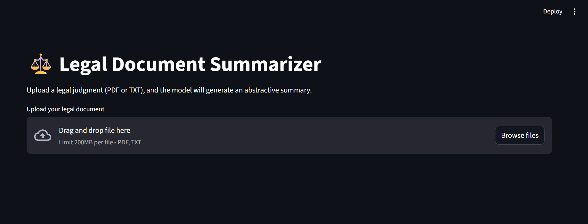
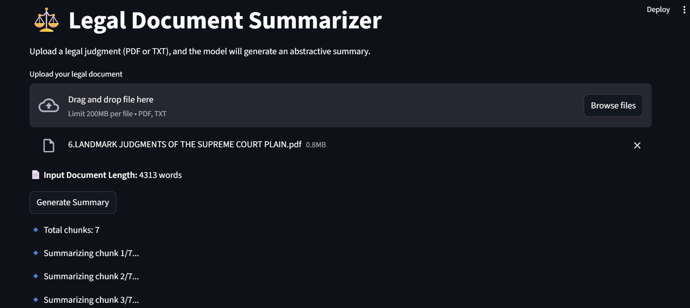
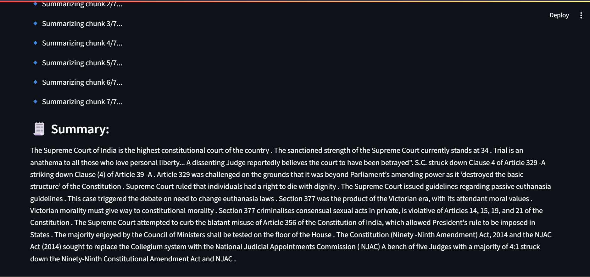

# ⚖️ Legal Document Summarizer — Indian Legal Judgments

## 🔹 Overview

This project focuses on **simplifying and summarizing Indian legal documents** (such as court judgments and petitions) to make them more accessible for the general public.  
The system follows the **exact pipeline described in the referenced research paper** — a **hybrid transformer-based summarization approach** that combines extractive and abstractive methods.

**Input →** A long Indian legal document (PDF or TXT)  
**Output →** A short, fluent, and simplified summary in plain language.

---

## 🧠 Research Basis

This work is implemented by following every step of the research paper:

> **“A Hybrid Transformer-Based Framework for Multi-Document Summarization of Turkish Legal Documents”**

All core components (scraping, preprocessing, extractive, abstractive, hybrid, and evaluation) replicate the methodology proposed in the paper — only adapted to Indian legal text.

---

## 🏗️ Project Workflow

1. **Data Scraping:** Extract Indian judgments from *Indian Kanoon* using BeautifulSoup.  
2. **Preprocessing:** Clean HTML → text, remove noise, tokenize, and mark important outcomes.  
3. **Extractive Summarization:** Use **TF-IDF** and **TextRank** to pick key sentences.  
4. **Abstractive Summarization:** Use **MT5-small** and **DistilBART (bart-small)** for fluent summaries.  
5. **Hybrid Summarization:** Combine extractive + abstractive results for better coherence.  
6. **Evaluation:** Compute **ROUGE-1**, **ROUGE-2**, **ROUGE-L**, cosine, precision, recall, and F1 scores.  
7. **Model Saving:** Save best model (by ROUGE-Sum) to `/models/final`.  
8. **Prediction:** Summarize any unseen PDF/TXT legal document.  
9. **Deployment:** Streamlit web app for real-time summarization.

---

## 📂 Folder Structure

CAPSTONE/
│
├── data/
│ ├── raw/ # Raw scraped HTML files
│ ├── preprocessed/ # Cleaned text ready for summarization
│ ├── pre_processed/ # Used in evaluation
│ ├── legal_stopwords.txt # Domain-specific stopwords
│
├── images/ # Streamlit dashboard screenshots
│ ├── mainframe.png
│ ├── image1.png
│ └── image2.png
│
├── models/
│ └── final/ # Best-performing model (bart-small)
│ ├── config.json
│ ├── generation_config.json
│ ├── merges.txt
│ ├── model.safetensors
│ ├── tokenizer_config.json
│ ├── tokenizer.json
│ └── vocab.json
│
├── reports/
│ ├── metrics/ # CSVs (extractive, abstractive, model comparison)
│ └── visuals/ # ROUGE/F1 comparison plots
│
├── results/
│ ├── extractive/ # Extractive summaries (TF-IDF, TextRank)
│ ├── abstractive/ # Abstractive summaries (MT5, BART)
│ └── hybrid/ # Combined hybrid summaries
│
├── src/
│ ├── scrape_data.py # Web scraping (Indian Kanoon)
│ ├── pre_processing.py # Cleaning & sentence tokenization
│ ├── extractive.py # TF-IDF / TextRank summarization
│ ├── abstractive.py # Transformer summarization (MT5 / BART)
│ ├── hybrid_summary.py # Combine extractive + abstractive
│ ├── evaluate.py # ROUGE/F1 metrics & plots
│ ├── save_model.py # Save best model based on ROUGE-Sum
│ ├── prediction.py # Summarize new PDF/TXT files
│ └── app.py # Streamlit web dashboard
│
├── reports/
│
├── Test_Files/ # Input PDFs/TXT for testing
├── Test_Output/ # Generated summaries for test inputs
│
├── venv/ # Virtual environment
│
├── .gitignore
├── code.ipynb # Notebook version of workflow
├── requirements.txt
└── README.md

---

## ⚙️ Features

✅ Web scraping of Indian legal judgments  
✅ Data preprocessing with HTML cleaning, tokenization, and filtering  
✅ Extractive summarization using TF-IDF and TextRank  
✅ Abstractive summarization using **google/mt5-small** and **sshleifer/distilbart-cnn-12-6**  
✅ Hybrid summarization integrating both methods  
✅ Evaluation metrics (ROUGE, cosine, precision, recall, F1)  
✅ Streamlit app for interactive summarization of PDF/TXT documents  

---

## 🧰 Installation

git clone https://github.com/your-username/Capstone_Project.git
cd Capstone_Project

## Sample Output

Extractive aggregated metrics (paper-style):
     method  cosine_mean  precision_mean  recall_mean  f1_mean
0     tfidf          1.0            1.0          1.0      1.0
1  textrank          1.0            1.0          1.0      1.0

Abstractive aggregated metrics (paper-style):
        model  rouge-1_mean  rouge-2_mean  rouge-L_mean  rouge-sum_mean
0  bart-small      0.326053      0.293145      0.304083        0.307760
1         mt5      0.022798      0.010405      0.022240        0.018481

## Run Streamlit Dashboard
streamlit run src/app.py

## 🖼️ Streamlit App Preview

📜 Another Example Output

The app allows users to upload .pdf or .txt files, automatically extract the text, and generate a simplified summary using the best-performing model (bart-small, fine-tuned on legal data).

##🔹 Streamlit App Preview

Below are screenshots of the deployed legal summarizer dashboard built using Streamlit:

### 🏠 Main Dashboard

### 📄 Example PDF Summary Output

The interface allows users to upload `.pdf` or `.txt` files, automatically extract text, and generate a simplified summary using the best-performing abstractive model (`bart-small` fine-tuned on legal text).

## 📊 Evaluation Metrics
Metric	Description
ROUGE-1 / 2 / L	Text overlap between generated and reference summaries
Cosine, Precision, Recall, F1	Extractive evaluation metrics
Word Reduction %	Text compression measure

## 🔮 Future Work

Add multilingual summarization (Hindi, Tamil, etc.)

Integrate Retrieval-Augmented Generation (RAG)

Deploy on Streamlit Cloud or Hugging Face Spaces

Enable live court case query and automatic summary generation

## ⚖️ License

This project is for academic and research purposes only.
All datasets and models follow their respective open licenses.
